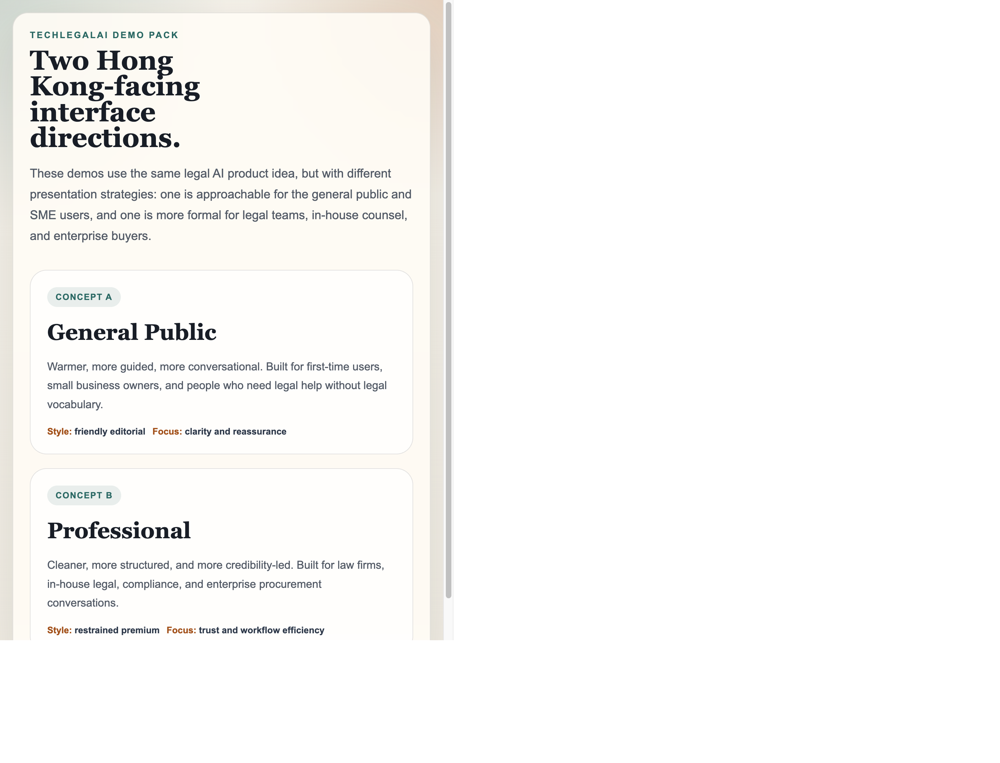
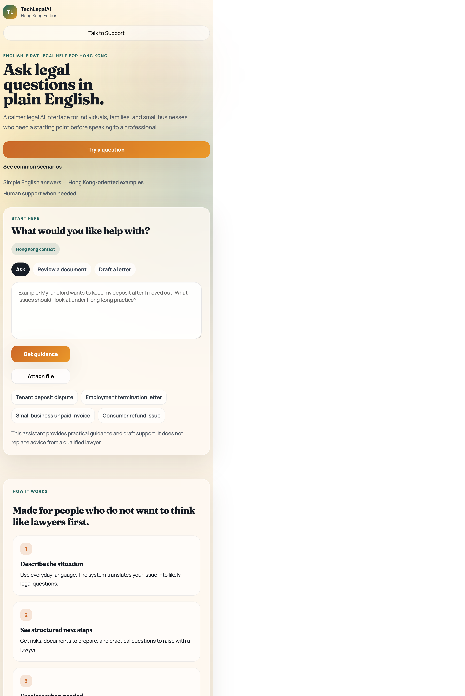
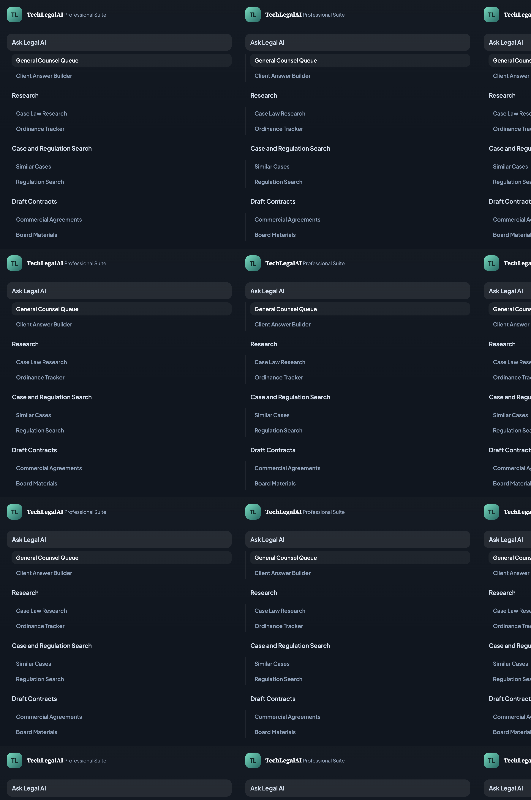

# TechLegal AI Demo

A frontend-only demo pack for an English-facing Hong Kong legal AI experience.

This project contains two separate UI directions:

- `general-public-demo/`: a warmer, guidance-first interface for individuals and SMEs
- `general-public-demo/services/`: dedicated public service pages for Hong Kong and Asia audiences
- `professional-demo/`: a more structured workspace for legal teams, in-house counsel, and enterprise review
- `professional-demo/services/`: dedicated English service pages aligned to the Deli AI service stack
- `index.html`: a simple selector page that links to both demos

## Preview

### Demo selector

### General public concept

### Professional concept

## Why this exists

This repository is intended for design review and developer handoff.
It does not include backend integration in the current stage.

The current demo focuses on:

- Hong Kong-facing English UI direction
- UI/UX comparison between public and professional audience types
- Static frontend patterns that can later be wired to a real backend
- Dedicated service architecture pages for:
   - AI Chat
   - Legal Research
   - AI Retrieval
   - Text Analysis
   - Contract Generation
   - Contract Review
   - Legal Documents
- Clear handoff structure so another development team can review quickly

## Reference basis

This demo pack was prepared with reference to the existing repository `Ackeseu/TechLegal-Demo`.
That reference repo helped shape:

- lightweight static-project packaging
- frontend-only handoff documentation
- backend adapter expectations for later integration
- repository readiness guidance for GitHub publishing

## Project structure

- `index.html`: root selector page
- `general-public-demo/index.html`: public-facing concept
- `general-public-demo/styles.css`: public-facing visual system
- `general-public-demo/script.js`: public-facing micro-interactions
- `general-public-demo/services/ai-chat.html`: public AI Chat service page
- `general-public-demo/services/legal-research.html`: public Legal Research service page
- `general-public-demo/services/ai-retrieval.html`: public AI Retrieval service page
- `general-public-demo/services/text-analysis.html`: public Text Analysis service page
- `general-public-demo/services/contract-generation.html`: public Contract Generation service page
- `general-public-demo/services/contract-review.html`: public Contract Review service page
- `general-public-demo/services/legal-documents.html`: public Legal Documents service page
- `general-public-demo/services/service.css`: shared design system for public service pages
- `general-public-demo/services/service.js`: shared public service-page behavior
- `professional-demo/index.html`: professional workspace concept
- `professional-demo/styles.css`: professional visual system
- `professional-demo/script.js`: professional navigation and sample content states
- `professional-demo/services/ai-chat.html`: AI Chat service page
- `professional-demo/services/legal-research.html`: Legal Research service page
- `professional-demo/services/ai-retrieval.html`: AI Retrieval service page
- `professional-demo/services/text-analysis.html`: Text Analysis service page
- `professional-demo/services/contract-generation.html`: Contract Generation service page
- `professional-demo/services/contract-review.html`: Contract Review service page
- `professional-demo/services/legal-documents.html`: Legal Documents service page
- `professional-demo/services/service.css`: shared design system for service pages
- `professional-demo/services/service.js`: shared service-page behavior
- `docs/PROJECT_DOCUMENTATION.md`: implementation and handoff notes
- `docs/REPOSITORY_READINESS.md`: publish and handoff checklist

## Run locally

No build step is required.

1. Open `index.html` in a browser.
2. Choose either the General Public or Professional demo.
3. Review the UI states and interactive sample content.

## Azure deployment

This repository now includes an Azure Static Web Apps GitHub Actions workflow:

- `.github/workflows/azure-static-web-apps.yml`

Target production site:

- `https://zealous-desert-07a533600.7.azurestaticapps.net`

One manual step is still required before GitHub Actions can deploy successfully:

1. In the GitHub repository settings, add a repository secret named `AZURE_STATIC_WEB_APPS_API_TOKEN`.
2. Use the deployment token from the matching Azure Static Web App resource.

After that, every push to `main` will trigger deployment.

## Backend integration note

This repository is intentionally frontend-only.

It now includes a production-integration scaffold in the shared layer:

- `shared/app-config.js`: environment, endpoint, timeout, and role config
- `shared/auth-client.js`: session/token/role handling from meta tags or local storage
- `shared/api-client.js`: authenticated API calls, professional role gating, upload endpoint hooks, and normalized API errors

Recommended future integration approach:

1. Keep the current UI structure and replace the mock/demo content logic in the JavaScript files.
2. Connect prompt submission flows to your real API or orchestration layer.
3. Return normalized response objects that include:
   - summary or assistant text
   - recommendations or actions
   - trust metadata such as jurisdiction or confidence
   - document or source references where applicable
   - escalation flags for legal review

## Production scaffold quick start

To test the live-ready auth path locally, set values in browser local storage:

1. `techlegal_api_base_url`: your API base URL (for example `https://api.example.com`)
2. `techlegal_access_token`: bearer token used by the shared API client
3. `techlegal_user_roles`: comma-separated roles (for example `professional,admin`)
4. `techlegal_user_id`: user identifier (optional but recommended)
5. `techlegal_session_id`: request/session trace identifier (optional)

Professional endpoints are role-gated by default to `professional` or `admin`.
You can override required roles via:

- `<meta name="techlegal-professional-roles" content="professional,admin">`

Public and professional upload flows are scaffolded through:

- `POST /v1/public/uploads`
- `POST /v1/professional/uploads`

## Suggested GitHub repository name

Recommended new repository name:

- `TechLegal-AI-Demo`

## Demo disclaimer

This repository is a UI demonstration only.
It should not be treated as legal advice, legal representation, or production-ready legal workflow software.